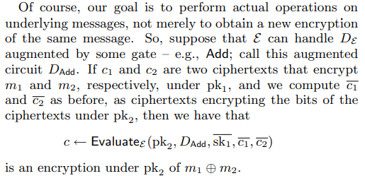

# The Working

### The Somewhat Homomorphic Encryption Scheme

_**We start with a SYMMETRIC scheme**_

_**F**_or security parameter λ, set N = λ, P = λ 2 and Q = λ 5

KeyGen**ε** (λ): The key is a random P-bit odd integer p.&#x20;

Encrypt**ε** (p, m): To encrypt a bit m ∈ {0, 1}, set m' to be a random N-bit number such that m' = m mod 2. Output the ciphertext c ← m' + pq, where q is a random Q-bit number.&#x20;

Decrypt**ε** (p, c): Output (c mod p) mod 2, where (c mod p) is the integer c' in (−p/2, p/2) such that p divides c − c'&#x20;

This scheme works because m' has same parity as m so all operations will follow correspondingly.

Ciphertexts from scheme **ε** are near-multiples of p.

.png>)

.png>)

.png>)_Try understand what this para mean_

### Bootstrapping (Going from SWHE to FHE)

.png>)

.png>)

Our scheme is now **ε**†. The bar indicate it is encrypted under pk2.

Evaluating D**ε** removes the noise associated to the first ciphertext under pk1 and Eval**ε** simultaneously introduces new noise while evaluating the ciphertexts under pk2.

In Recryptε, the message m is doubly encrypted at one point, first under pk1 and next under pk2 . Ordinarily, the only thing one can do with a doubly-encrypted message is to peel off the outer encryption first, and then decrypt the inner layer. However, the Evalε algorithm is used to remove the inner encryption.

This consists of a sequence of public keys (pk1 , ..  , pk l+1) and a chain of encrypted secret keys (sk 1 bar, .., sk l bar) where sk i is encrypted under pk i+1

Putting these encrypted security keys under public key is **NOT** a problem as it is semantically secure.

### Circular secure&#x20;

This is still not fully homomorphic as quite meet our definition of fully homomorphic encryption, since the complexity of KeyGen**ε**† grows linearly with the maximum circuit depth we want to evaluate, although Encrypt and Decrypt functions do not depend on f at all.

We do not need distinct public keys pki for each circuit level and an acyclic chain of encrypted secret keys. Instead, the public key in E† can consist merely of a single public key pk and a single encrypted secret key sk **bar** (sk under pk), where pk is associated to all levels of the circuit. This approach has the additional advantage that we don't need to decide beforehand the maximum circuit depth complexity of the functions that we want to be able to evaluate.
